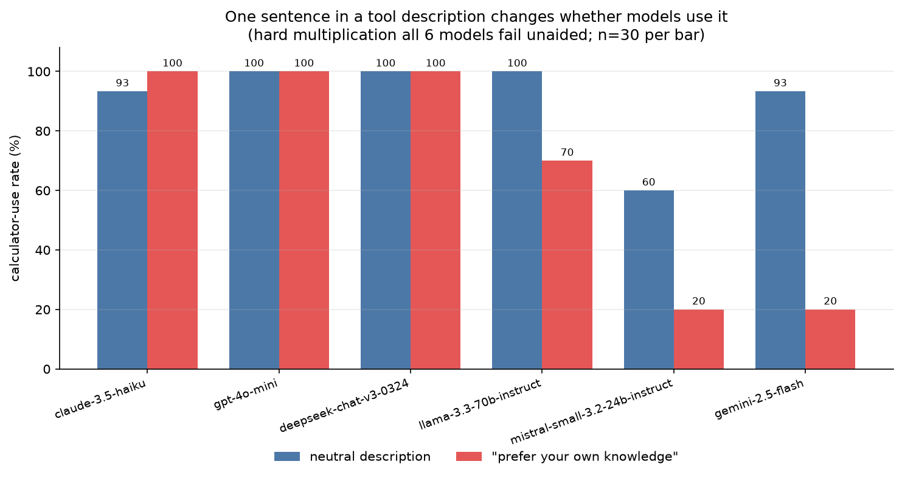

# toolbench

> A tiny, dependency-light harness for measuring how a tool's **description**
> changes whether — and when — an LLM actually calls it, across models.

[](https://github.com/Adityaraj0421/toolbench/actions/workflows/ci.yml)

[](LICENSE)

Change one sentence in a tool's description and a model's accuracy can swing 70+
points — or not move at all. It depends on the model. `toolbench` lets you
measure exactly that: define a tool as a plain Python function, sweep it across
models and prompt variants, and get full traces plus a metrics table. The agent
loop is ~60 readable lines and there's no framework underneath.

## The finding that started this

Give six models a calculator and one hard multiplication they **all** fail
unaided (0% correct with no tool). Then change one sentence in the calculator's
description from neutral to *"prefer answering from your own knowledge"* and
rerun. Tool-use rate (n=10; accuracy tracks it almost exactly):

| Model | neutral | "prefer your own knowledge" | |
|---|---|---|---|
| `gpt-4o-mini` | 100% | 100% | description-proof |
| `deepseek-chat-v3` | 100% | 100% | description-proof |
| `claude-3.5-haiku` | 93% | **100%** | uses the tool *more* |
| `llama-3.3-70b` | 100% | 70% | partial under-calling |
| `gemini-2.5-flash` | 93% | **20%** | collapses (−73 pts) |
| `mistral-small-3.2` | 60% | **20%** | collapses |



The same sentence ranged from harmless to catastrophic to *beneficial* depending
on the model. **There is no model-independent "good" tool description.** Full
writeup, including over-calling and decoy-tool experiments:
**[docs/FINDINGS.md](docs/FINDINGS.md)**.

## Quickstart

```bash
git clone https://github.com/Adityaraj0421/toolbench
cd toolbench
python3 -m venv .venv && . .venv/bin/activate
pip install -e ".[dev]"

pytest                       # 27 tests, fully offline, no API key needed

export OPENROUTER_API_KEY=sk-or-...   # only needed to run live experiments
python -m toolbench run experiments/example.yaml
```

A summary table prints to stdout; per-cell JSONL traces and a `summary.json`
land in `runs/<experiment-name>/`.

## Define a tool — the whole contract

A tool is a function with type hints and a docstring. `@tool` derives the
JSON schema the model needs from the signature; the docstring summary becomes the
description the model reads, and the `Args:` lines become per-parameter docs.

```python
from toolbench.tools import tool

@tool
def calculator(expression: str) -> str:
    """Evaluate a basic arithmetic expression.

    Args:
        expression: A math expression like "2 * (3 + 4)".
    """
    return str(_safe_eval(expression))
```

Register it in `toolbench/builtins/__init__.py` (`_ALL`), then name it under
`tools:` in an experiment config. That's it — no registration boilerplate.

## Run an experiment

An experiment is a YAML file describing a matrix of `tasks × models × variants ×
repeats`. Each cell runs the agent loop once and produces a trace.

```yaml
name: calc-vs-fetch
task: "What is 17% of 2,340? Reply with only the number."
models:
  - openai/gpt-4o-mini
  - google/gemini-2.5-flash
tools: [calculator, http_fetch]
variants:
  - name: baseline
  - name: terse-desc
    overrides:
      calculator: { description: "Math." }   # patch the schema, no code change
repeats: 5
```

### Experiment axes

- `models:` — multi-model A/B (any OpenRouter model string)
- `tasks:` — a list of `{name, prompt}` (or a single `task:`); great for difficulty sweeps
- `variants:` — patch a tool's `name`/`description`/`parameters` per variant and rerun
- `repeats:` — run each cell N times to get rates instead of anecdotes
- `max_output_tokens:` — per-call output cap (default 1024). Keep it low; OpenRouter
  reserves worst-case cost against a model's full max, so an uncapped request can 402
  on a low-credit account even for a one-line answer.

## How it works

```
toolbench/
  tools.py        @tool decorator, schema derivation, ToolRegistry
  client.py       OpenRouter client (OpenAI-compatible) + FakeClient for tests
  agent.py        run_agent() — the ~60-line tool-calling loop
  trace.py        Trace dataclass + JSONL writer
  metrics.py      per-trace metrics
  experiment.py   load config, expand the matrix, run, aggregate
  cli.py          `python -m toolbench run <config>`
  builtins/       calculator, http_fetch (SSRF-guarded), files (sandboxed), weather (decoy)
```

Tool errors are fed back to the model as `ERROR: ...` so it can recover; API
errors retry with backoff and one failed cell never kills the matrix. Tests use
an injected `FakeClient`, so the whole loop is verifiable offline with no key.

> **Safety:** the calculator uses an AST allowlist (no `eval`), `http_fetch` is
> GET-only with an SSRF guard, file tools are confined to a `workspace/` sandbox,
> and `run_shell` exists but is deliberately **not** registered (opt-in only).

## The experiments in this repo

| Config | Question |
|---|---|
| `over-calling.yaml` | Do models call a tool for trivial math, and can the description stop them? |
| `difficulty-sweep.yaml` | Is there a difficulty "threshold" where tool use kicks in? |
| `decoy-tool.yaml` | With two tools offered, do models pick the wrong one? |
| `under-calling.yaml` + `no-tools-baseline.yaml` | Does a discouraging description make models skip a tool they need? |
| `under-calling-xmodels.yaml` | Does that effect generalize across vendors? |

Results and interpretation: **[docs/FINDINGS.md](docs/FINDINGS.md)**.

## Caveats

This is a small experiment, not a benchmark. Samples are n=5–10, tools are mocked
(no real latency or failure), the models are the cheaper variants accessed via
OpenRouter's compatibility layer, the tasks are arithmetic, and the discouraging
prompt is deliberately adversarial. Treat the numbers as directional.

## Why this exists

It started while poking through
[CL4R1T4S](https://github.com/elder-plinius/CL4R1T4S), a collection of leaked LLM
system prompts. Seeing how much hidden prompt scaffolding shapes model behavior
raised the question: how much does a single *tool* description matter? This is the
harness built to find out.

## License

MIT — see [LICENSE](LICENSE).
